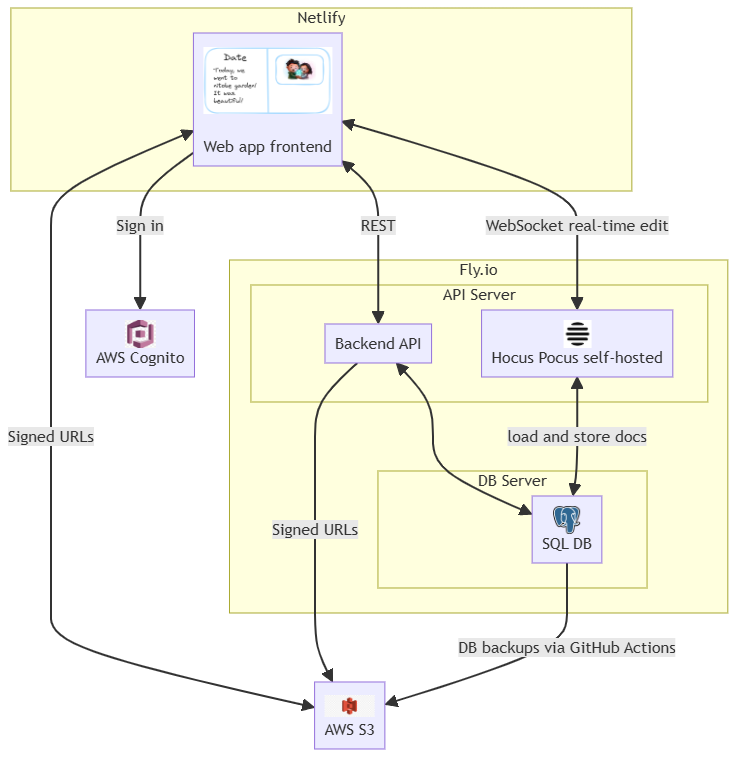

# Our Story

An application made by Andy and Arya so that they can record every memory they make together. Arya likes to re-read dates and Andy likes to build web apps <3. https://our-story-application.netlify.app/

## Technologies Involved 
React, TypeScript, Vite, Node, Express, AWS S3, AWS Cognito, Sequelize, Github actions, Alembic

## Architectural Diagram

## Demo 

## Components of our application 

**Frontend: React, Tailwind, Vite**  
 
**Flipbook:**
- Created a custom flipbook in React and Tailwind CSS without using third-party APIs, handling all CSS transitions and z-index layering of pages manually using useState hooks
- Resolved race conditions across interdependent useState hooks by designing and implementing finite state machine-style logic to manage complex asynchronous state transitions reliably
- Implemented dynamic pagination to efficiently fetch documents in chunks, maintaining accurate page indexing across refetches for seamless user experience.
- Attempted to integrate react-pageflip, but opted for a custom solution due to its limitations with rendering different page components: https://github.com/Nodlik/react-pageflip/issues/2

**Collaborative text editor**: 
- Built a real-time collaborative text editor using TipTap with a self-hosted Hocus Pocus server, enabling simultaneous multi-user editing
- Implemented a cleanup function in useEffect to destroy the WebSocket provider on page transitions, limiting concurrent connections when users flip pages to one

**Image Carousel**:
- Utilized server-side generated signed URLs for image upload and retrieval via Amazon S3 inorder to offload file transfer traffic from our servers, resulting in decreased server hosting costs

**All Stories page**: 
- Implemented infinite scrolling and pagination similar to Instagram, enabling seamless content loading as users scroll

**Backend: Node, Express, Sequelize**
**Server**: 
- Run a self-hosted Hocus Pocus server for TipTap collaboration; it loads and stores documents in our database. A scheduled job syncs ydoc binary data to JSON in our DB for reliability and backup
- Configured GitHub Actions to automate daily pg_dump backups of our database and used the AWS CLI to store them in the S3 Glacier tier, reducing long-term storage costs
## Challenges
**Flipbook**: 
- The flipbook component was by far the most challenging part of the application. I initially searched for a suitable library and found react-pageflip, which I almost got working. However, I ran into a critical limitation: the function to programmatically jump to a specific page didn't work as expected. After extensive digging, I found a GitHub comment explaining that dynamically generated pages require identical child components across all pages. Sadly, this was a major constraint for my use case. As a result, I decided to build the flipbook from scratch, carefully managing CSS z-index changes and flip animations using useState. In hindsight, useReducer might have been a better fit, since my implementation closely resembled a finite state machine with interdependent state transitions. 
- Additionally, the flipbook needed to paginate documents efficiently to avoid loading all of them at once. This required implementing a refetching mechanism while maintaining accurate tracking of the current page index, even after new data was fetched. Ensuring smooth user experience during dynamic data loading added another layer of complexity to the component's logic.
- I also had to debug asynchronous issues, such as users rapidly clicking the "next page" button. This was something that couldn’t be fully mitigated with simple debouncing. 

**Collaborative Text Editor**:
- I built a collaborative rich-text editor using TipTap backed by a self-hosted Hocuspocus server after the hosted tier was discontinued (so sad, I had to change the architecture of this project to self host the hocus pocus server after the site was "feature complete"). For the frontend, the editor lives inside a flipbook where each page contains its own editor instance. So one of the first challenges was managing WebSocket connections. Without control, flipping pages would create multiple active connections per user and quickly exhaust server resources. I solved this by implementing cleanup logic in useEffect so only one active collaborative session exists per user at a time.

On the backend, documents are persisted as the binary CRDT state from Yjs instead of JSON. This allows concurrent edits to merge safely and also prevents data loss. If the collaboration server restarts or crashes, the full document state can be reconstructed directly from the database rather than relying on in-memory sessions (Although a todo would be to explore using redis to lower the number of DB writes...hmmmm..., while maybe somehow still protecting against crashes? Hmm....)

A scheduled cron job converts the CRDT state into JSON purely for inspection and tooling. The frontend still renders directly from the CRDT document, while the JSON snapshot exists to make the content human readable and easier to debug.

This project required reading unfamiliar documentation, understanding CRDT synchronization, and adapting architecture decisions after the hosted collaboration service was removed. It taught me how realtime systems differ from traditional request-response apps and how persistence strategies impact scalability and correctness.

**Image handling**: 
- I used AWS S3 for image storage, but noticed that many tutorials recommended making the bucket public (probably for the sake of making the tutorial easy). Instead, I configured the bucket with public access blocked and created an IAM user with permission policies to upload, retrieve, and delete objects. In our application, we generate signed URLs server-side and pass them to the frontend. The frontend then uses these URLs to interact directly with S3 for uploading, fetching, and deleting images. This approach not only keeps the bucket secure but also offloads traffic from our server, helping to reduce hosting costs.

